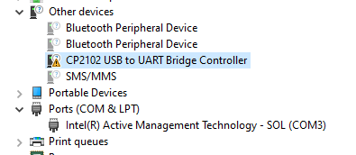

# miniInvaderFW

## Getting started
Prepare yourself for an adventure in robotics! And remember, the real treasure in programming is not the result but the bugs we make along the way.

### Assembly
Connect the right motor to connector J2 and the left motor to J3.

### Configure Wi-Fi or Bluetooth via serial
* Connect board to computer via USB
* Establish [serial connection](https://docs.espressif.com/projects/esp-idf/en/release-v4.1/get-started/establish-serial-connection.html)

You can connect for example using screen:

    screen [port] 115200

### Controlling the robot

Once you have set up the Wi-Fi connection, you should be able to control the robot by sending UDP messages to port 3000. The message should be a string consisting of two integers between 100 and -100 separated by a semicolon. You can try it out e.g. with the following command:

    echo -n '50;-50' | nc -u [robot ip] 3000

Or by modifying and running the [python example](examples/send-udp.py)

---

## Development

Install the Espressif toolchain v4.1.2 from https://dl.espressif.com/dl/esp-idf/. Scroll down to the bottom to find the older versions.

Activate the ESP-IDF environment in your command line of choice. (Instructions TBD)

With the ESP-IDF environment activated, idf.py should be included in PATH and you should be able to run it from anywhere. The following instructions require that the current working directory is the root of this repository.

Test that the environment is installed and activated properly:

    idf.py --version

Run menuconfig and ensure that:
* bluetooth controller mode is set to BR/EDR Only from `Component config > Bluetooth > Bluetooth controller > Bluetooth controller mode`
* bluetooth classic and SPP is enabled and BLE is disabled from `Component config > Bluetooth > Bluedroid options`
* the custom partition table partitions.csv is selected from `Partition table > Partition table (Custom partition table CSV)`
* at least 4MB flash size is selected from `Serial flasher config > Flash size`
```
    idf.py menuconfig
```

Connect the board to your device using a micro-USB cable. You do not need to attach the batteries, the board can be flashed with just the USB powering it.

Check which port your board is connected to:

On Windows this is easy to do using the Device Manager. Open the Device Manager and look for **Ports (COM & LPT)**. You should see a device named `Silicon Labs CP210x USB to UART Bridge` and after the name the COM port it's connected to (COM5 in the screenshot but may vary).


If you do not see the device, check **Other devices** for `CP2102 USB to UART Bridge Controller`. To get the device connected to the COM port, you probably need to [install the appropriate driver](https://www.silabs.com/developers/usb-to-uart-bridge-vcp-drivers?tab=downloads). For Windows use `CP210x Windows Drivers` as it has an executable installer and the Universal one does not.




Build the project:

    idf.py build

Flash it to the board memory:

    idf.py -p [port] flash
    # Windows e.g. idf.py -p COM5 flash
    # Linux e.g. idf.py -p /dev/ttyS2

Monitor:

    idf.py -p [port] monitor

To exit the monitor press `ctrl + ]` (`ctrl + 5` On a Finnish keyboard)